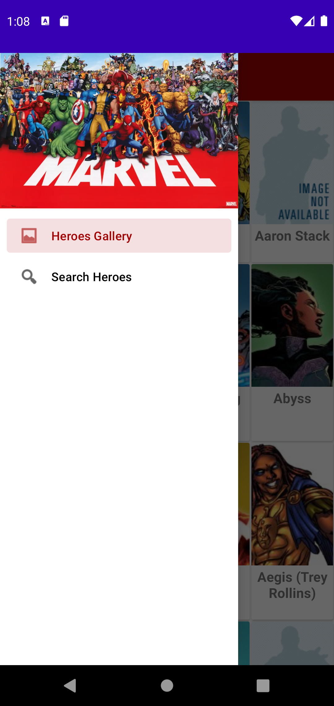
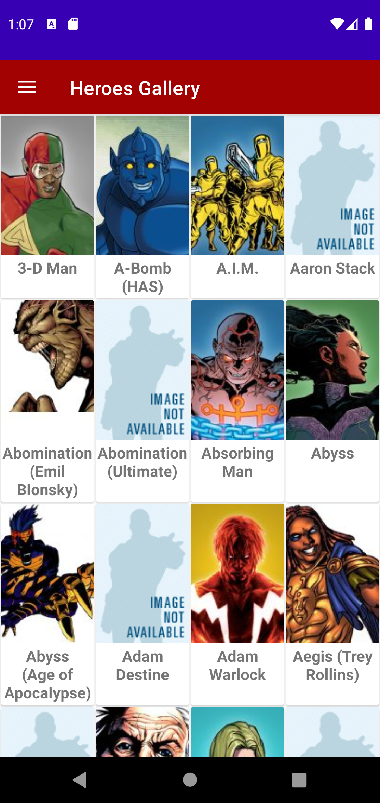
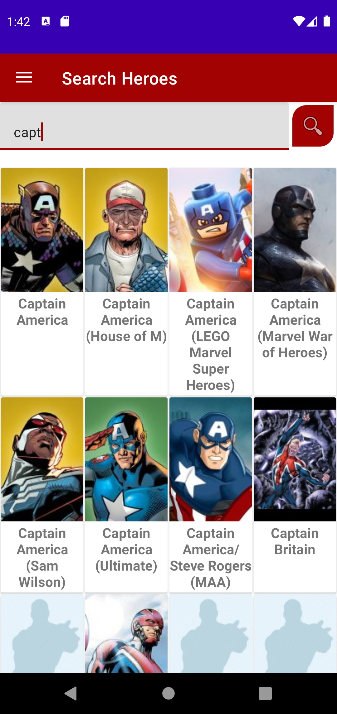
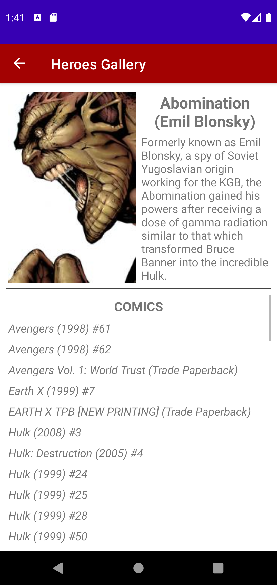

# Marvel Heroes

This app gives you access to all data about your favourite Marvel superheroes.

## Libraries and APIs

- __Retrofit 2.9.0__: Requests to REST services of the Rick and Morty's online API.

- __GSon converter 2.9.0__: Handling and managing JSON format of the API responses.

- __Room 2.4.2__: Handling and managing the SQLite database.

- __Dagger 2.41__: Handling and managing dependency injection.

- __MockK 1.12.3__: Mocking and verifying of elements for tests.

- __Turbine 0.6.1__: Library for testing flows.

## Architecture

The architecture used is a MVVVM because the business logic and is highly decoupled. Every module in the app structure only depends on its module below. 

The app structure follows the next schema:

> VIEW <-> VIEWMODEL <-> DOMAIN (Use Cases) <-> DATA (Datasources + Repositories)

Each of these sections is contained in a module:

- __View__: UI elements of the app: activities, fragments, dialogs, etcetera.

- __ViewModel__: Handles and manages the UI data.

- __Domain__: Set of uses cases used in ViewModel to get and store the data.

- __Data__: In this module are managed the data sources of the app and offers a repository interface to deal with them.

## Sections of the app

The app is divided in two main sections, as it is shown in the menu displayed in the following image:

### __Heroes Gallery__

Display the list of characters paginated in 30-characters pages:

### __Search Heroes__

Allow the user to search heroes by the first letters of their names.

### __Detail__

When the user clicks on any character card, he will be led  to the detail page of the selected character.

